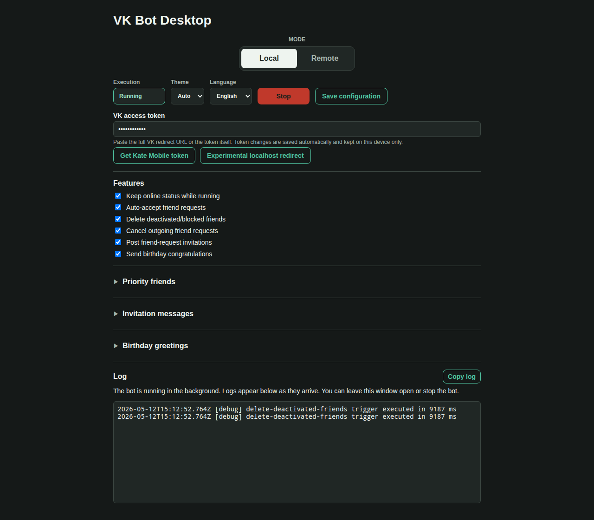

# Issue 39 Case Study: delete-deactivated-friends local-mode TypeError

## Scope

Issue:
[konard/vk-bot-desktop#39](https://github.com/konard/vk-bot-desktop/issues/39)

Pull request:
[konard/vk-bot-desktop#40](https://github.com/konard/vk-bot-desktop/pull/40)

Branch: `issue-39-5d7ef40481ba`

The reporter enabled the local-mode `delete-deactivated-friends` trigger and
saw the trigger fail with:

```text
TypeError: object is not iterable (cannot read property Symbol(Symbol.iterator))
    at new Set (<anonymous>)
    at pickDeactivatedToDelete (.../src/bot/friend-prioritization.js:112:24)
```

The same report asked for a desktop button that copies the visible log, because
the issue evidence had to be copied from the UI manually.

## Captured Evidence

- `issue.json` - raw issue payload from `gh issue view`.
- `issue-comments.json` - issue comments at investigation time.
- `pr-40.json` - initial pull request metadata.
- `screenshot-log-copy.png` - reporter screenshot from the GitHub issue.
- `repro-focused-before-fix.log` - focused failing tests before the fix.
- `repro-tests-before-fix.log` - first broad pre-fix test attempt before
  dependencies were installed.
- `focused-tests-after-fix.log` - focused passing tests after the fix.
- `build-renderer.log` - renderer build output after the UI change.
- `npm-install.log` - dependency install output used for local verification.
- `log-copy-after.png` - Playwright-rendered screenshot after adding the copy
  button.
- `upstream-vk-bot-head.txt` - exact `konard/vk-bot` commit used for
  comparison.
- `upstream-delete-deactivated.diff`,
  `upstream-delete-outgoing.diff`, and
  `upstream-accept-friend-requests.diff` - trigger comparisons against
  `konard/vk-bot`.

## Timeline

| Time (UTC)              | Event                                                                                                                                                               |
| ----------------------- | ------------------------------------------------------------------------------------------------------------------------------------------------------------------- |
| 2026-05-12 15:12:27.125 | First captured session opens a persisted log file under `/Users/konard/.vk-bot-desktop/logs/`.                                                                      |
| 2026-05-12 15:12:27.148 | Bot starts and then exits with code 0. The excerpt does not include a trigger stack for this first session, so it is not enough evidence for a separate root cause. |
| 2026-05-12 15:12:43.554 | Second captured session opens a new persisted log file.                                                                                                             |
| 2026-05-12 15:12:43.577 | Runner logs `Checking for 'delete-deactivated-friends' trigger...`.                                                                                                 |
| 2026-05-12 15:12:52.763 | Trigger logs `Could not delete deactivated friends` with the `TypeError` at `new Set(priorityFriendIds)`.                                                           |
| 2026-05-12 15:12:52.764 | Runner logs the trigger duration. The trigger caught the error, so the process kept running.                                                                        |
| 2026-05-12 15:13:18.572 | User stops the bot.                                                                                                                                                 |
| 2026-05-12 15:14:36     | Issue #39 is filed with the copied log excerpt, screenshot, upstream comparison request, and log-copy button request.                                               |

## Requirements Extracted From Issue 39

1. Fix `delete-deactivated-friends` in local mode.
2. Reproduce the reported failure from the copied stack trace.
3. Compare the implementation with `konard/vk-bot` and identify whether the
   desktop port diverged from the working upstream behavior.
4. Preserve issue evidence under `docs/case-studies/issue-39/`.
5. Reconstruct the timeline, requirements, root causes, and solution options.
6. Search online for known components or APIs that help with the requested log
   copy workflow.
7. Add debug output only if the root cause cannot be proven from available data.
8. Add a user-facing button that copies the visible log.
9. Verify the fix with automated tests, renderer build, and a browser screenshot.
10. Complete the work in PR #40.

## Reproduction

The crash is reproducible without VK API access by calling the selector with
the same malformed value shape found at the failing stack frame:

```sh
node -e "import('./src/bot/friend-prioritization.js').then(({pickDeactivatedToDelete})=>{try{pickDeactivatedToDelete({friends:[{id:1,deactivated:'banned'}],priorityFriendIds:{}})}catch(e){console.log(e.name+': '+e.message)}})"
```

Before the fix this prints:

```text
TypeError: object is not iterable (cannot read property Symbol(Symbol.iterator))
```

The config-layer reproduction is:

```js
await store.saveConfig({ priorityFriendIds: [] }, 'global');
const loaded = await store.loadLayered();
```

Before the fix the empty array serialized as a bare Links Notation key and
loaded back as:

```json
{ "priorityFriendIds": {} }
```

That value then flowed through `mergeWithDefaults()` unchanged and reached
`new Set(priorityFriendIds)`.

## Root Causes

### Root cause 1: empty Links Notation arrays loaded as objects

`src/lino-store.js` encoded an empty scalar array as a bare key:

```text
priorityFriendIds
```

The same parser interprets a bare key as an object container, because in Links
Notation the next indented lines could be child fields. With no child lines,
the result is `{}`. For `priorityFriendIds`, that means "empty list" became
"empty object".

The fix has two layers:

1. `formatArrayChild()` no longer writes empty arrays as bare keys, so newly
   saved default lists are omitted and then restored from `DEFAULT_CONFIG`.
2. `mergeWithDefaults()` normalizes list fields from existing config files, so
   legacy bare-key values like `{}` become `[]`.

The normalizer also handles scalar one-item list values, because the inline
codec reads `communities 123` as `123` rather than `[123]`.

### Root cause 2: trigger selectors trusted config list types

`pickDeactivatedToDelete()` created `new Set(priorityFriendIds)` directly. That
is fine for the upstream static array, but the desktop app has a user-editable
config boundary and can load legacy or malformed values.

The fix adds a small shared list coercion helper and uses it in:

- `pickDeactivatedToDelete()`
- `pickPrioritySendList()`
- `pickOutgoingToCancel()`

This preserves the same priority-friend contract while preventing a bad config
shape from crashing trigger logic.

### Root cause 3: no one-click log copy in the desktop UI

Issue #32 added persisted session logs, but the visible desktop log still had
no copy affordance. The reporter had to copy text from the UI or screenshot.

The fix adds a compact `Copy log` button next to the Log heading. It copies the
visible log text and reports success/failure through the existing toast system.

## Upstream Comparison

The comparison was made against `konard/vk-bot` commit
`175d2d13218d9e791ae2f3e824a0d24f10319dcb`.

`konard/vk-bot` keeps `priorityFriendIds` in `utils.js` as a regular
JavaScript array and uses it directly in trigger code. It does not have this
desktop repository's layered Links Notation config loader, editable React
settings form, or config merge step. Therefore the upstream trigger never sees
the `{}` shape that caused the desktop crash.

The desired behavior is still the same as upstream: priority users are never
deleted or cancelled automatically. The desktop-specific fix is to normalize
the additional storage/config boundary introduced by this app.

No upstream GitHub issue was filed because the proven defect is local to
`vk-bot-desktop`'s Links Notation serialization and Electron UI, not to
`konard/vk-bot`.

## Online Research

- Electron's official `clipboard` API provides `clipboard.writeText(text)` and
  recommends exposing clipboard access to the renderer through preload and
  `contextBridge`, because direct renderer use of the Electron clipboard module
  is deprecated:
  <https://www.electronjs.org/docs/latest/api/clipboard>
- MDN documents `navigator.clipboard.writeText()` as an async browser API that
  returns a Promise after the system clipboard is updated, with secure-context
  restrictions in browsers:
  <https://developer.mozilla.org/en-US/docs/Web/API/Clipboard/writeText>

The implementation follows Electron's preload bridge for packaged desktop
runs, with `navigator.clipboard.writeText()` only as a test/browser fallback.

## Alternatives Considered

1. Teach the generic Links Notation parser that certain bare keys mean arrays.
   Rejected because the codec intentionally has no schema/type markers and is
   also used for non-config data.
2. Switch config storage to JSON. Rejected because project requirements require
   Links Notation for config, state, and cache.
3. Normalize only in `pickDeactivatedToDelete()`. Rejected as incomplete,
   because other priority-list logic uses the same config field.
4. Normalize only in `mergeWithDefaults()`. Useful but not sufficient defense
   for selector unit tests and direct callers.
5. Copy the persisted log file instead of the visible log pane. Rejected for
   the requested workflow: the user asked for a button that simplifies copying
   what is visible in the UI.

## Solution

1. Normalize config list fields in `mergeWithDefaults()`:
   `priorityFriendIds`, `invitationPost.messages`,
   `invitationPost.communities`, and `birthdayGreetings`.
2. Stop emitting empty arrays as bare Links Notation keys.
3. Make priority-aware selectors tolerant of legacy/malformed list values.
4. Add an Electron clipboard IPC bridge through preload:
   `window.vkbot.copyText(text)`.
5. Add a renderer clipboard helper with a browser fallback for tests.
6. Add the `Copy log` button and translations for English and Russian.
7. Add focused regression tests for the malformed `{}` value and clipboard
   bridge.

## Verification

- Focused pre-fix reproduction:
  `docs/case-studies/issue-39/repro-focused-before-fix.log`
- Focused post-fix tests:
  `node --test --test-timeout=30000 tests/friend-prioritization.test.js tests/lino-store.test.js tests/delete-outgoing-friend-requests.test.js tests/renderer-clipboard.test.js tests/i18n.test.js`
- Renderer build:
  `npm run build:renderer`
- Browser verification:
  Playwright loaded the built renderer at `http://127.0.0.1:4173/`, injected a
  sample log line, verified the `Copy log` button was enabled, and saved:
  `log-copy-after.png`.


